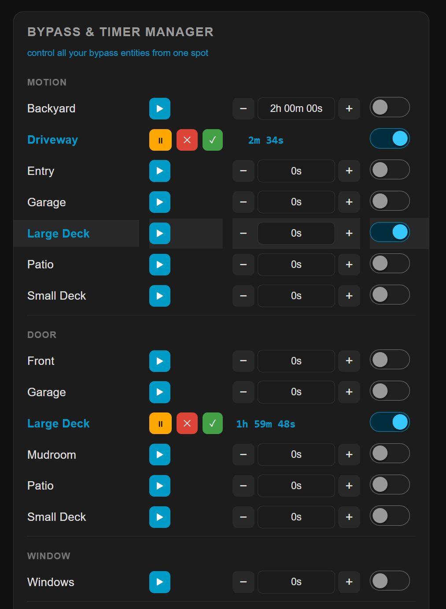

# Bypass & Timer Manager Card

> A Home Assistant Lovelace card that **automatically discovers** your bypass `input_boolean` and `timer` entities, pairs them by matching Entity ID Suffix or Label, groups them by type, and gives you full timer control — all with a built-in visual editor and zero manual entity lists.

---

## Features

- **Zero-config auto-discovery** — scans all entities at runtime, no YAML lists needed
- **Two discovery modes** — match entities by ID prefix *or* by HA label
- **Automatic pairing** — matches each `input_boolean` with its `timer` by identical suffix
- **Smart grouping** — rows sorted into Motion / Door / Window / Light / Other sections automatically, with support for custom groups
- **Full timer control** — Start, Pause, Resume, Cancel, Finish; editable duration input; live countdown; +/− step buttons
- **Last Changed row** — optional second line per entity showing relative time since last switch/timer change
- **Built-in visual editor** — configure everything in the Lovelace UI without touching YAML
- **Deep appearance customization** — per-element font sizes and colors, secondary info line, theme-aware defaults
- **Display name cleaning** — strips prefix, group keywords, and custom words automatically



---

## Installation

### HACS (recommended)

[](https://my.home-assistant.io/redirect/hacs_repository/?owner=Ltek&category=Integration&repository=https%3A%2F%2Fgithub.com%2FLtek%2Fbypass-manager-card)

1. Click the button above, or go to **HACS → Frontend → ⋮ → Custom repositories**
2. Add this repo URL with category **Lovelace**
3. Install **Bypass & Timer Manager Card**
4. Hard-refresh your browser (`Ctrl+Shift+R`)

### Manual

1. Copy `bypass-manager-card.js` to:
   ```
   /config/www/community/bypass-manager-card/bypass-manager-card.js
   ```
2. In HA → **Settings → Dashboards → Resources**, add:
   - **URL:** `/local/community/bypass-manager-card/bypass-manager-card.js`
   - **Type:** `JavaScript Module`
3. Hard-refresh your browser (`Ctrl+Shift+R`)

---

## Quick Start

```yaml
type: custom:bypass-manager-card
```

That's it — entities are discovered and displayed automatically.

---

## Discovery Modes

### Prefix mode (default)

The card finds every entity whose ID starts with the configured prefix (default: `bypass_`).

```
input_boolean.bypass_motion_driveway  ←→  timer.bypass_motion_driveway
input_boolean.bypass_door_garage      ←→  timer.bypass_door_garage
input_boolean.bypass_window_kitchen   ←→  timer.bypass_window_kitchen
```

### Label mode

The card finds every `input_boolean` and `timer` that has a specific HA label assigned, regardless of entity ID naming.

```yaml
type: custom:bypass-manager-card
discovery_mode: label
discovery_label: bypass          # matches any label ID starting with "bypass"
```

---

## Entity Grouping

Entities are automatically sorted into sections based on keywords in the entity suffix:

| Keyword in suffix | Section |
|-------------------|---------|
| `motion`          | Motion  |
| `door`            | Door    |
| `window`          | Window  |
| `light`           | Light   |
| *(none of above)* | Other   |

Custom groups can be added in the visual editor (Entity Groups section) or via YAML:

```yaml
custom_types:
  - keyword: fan
    label: Fan
  - keyword: lock
    label: Lock
```

Custom keywords are checked before built-ins, so they can override default grouping.

---

## Timer Input Formats

The duration input field accepts natural shorthand:

| Input    | Duration     |
|----------|--------------|
| `30`     | 30 minutes   |
| `30m`    | 30 minutes   |
| `90s`    | 90 seconds   |
| `1h`     | 1 hour       |
| `1h30m`  | 1.5 hours    |
| `2m30s`  | 2 min 30 sec |

---

## Full Configuration Reference

All options are configurable in the **visual editor** — YAML is only needed for advanced setups.

### Discovery

| Key | Default | Description |
|-----|---------|-------------|
| `discovery_mode` | `prefix` | `prefix` or `label` |
| `entity_prefix` | `bypass_` | Prefix to match in prefix mode |
| `discovery_label` | `bypass` | HA label to match in label mode (partial match) |

### Entity Groups & Name Cleaning

| Key | Default | Description |
|-----|---------|-------------|
| `type_filters` | all groups | Array of group names to show, e.g. `["Motion","Door"]` |
| `custom_types` | `[]` | Array of `{ keyword, label }` for custom groups |
| `strip_words` | `["bypass"]` | Words removed from display names (case-insensitive) |
| `strip_group_word` | `true` | Also strip the group keyword (motion, door, etc.) from names |

### Timer

| Key | Default | Description |
|-----|---------|-------------|
| `increment_step` | `1` | Amount each +/− button adjusts a timer |
| `increment_unit` | `minutes` | `seconds`, `minutes`, or `hours` |

### Appearance — Visibility

| Key | Default | Description |
|-----|---------|-------------|
| `show_entity_names` | `true` | Show entity name column |
| `show_toggle` | `true` | Show the bypass on/off switch |
| `show_timer_controls` | `true` | Show Start / Pause / Cancel / Finish buttons |
| `show_timer_input` | `true` | Show editable duration input, countdown, and +/− buttons |
| `show_button_labels` | `false` | Show text labels next to action icons |
| `show_last_changed` | `false` | Show a second row with relative last-changed time |
| `show_timer_badge` | `false` | Show "timer only" badge on timer-only rows |
| `show_group_labels` | `true` | Show group section headings (Motion, Door, etc.) |
| `show_dividers` | `true` | Show horizontal rules between groups |

### Appearance — Card Header

| Key | Default | Description |
|-----|---------|-------------|
| `title` | `BYPASS & TIMER MANAGER` | Card title text (rendered as typed — no forced case) |
| `font_size_title` | `13` | Title font size (px) |
| `color_card_title` | theme | Card title text color |
| `secondary_info_text` | *(hidden)* | Optional subtitle line below the title |
| `secondary_info_size` | `11` | Secondary info font size (px) |
| `secondary_info_color` | theme accent | Secondary info text color |

### Appearance — Colors & Fonts

| Key | Default | Description |
|-----|---------|-------------|
| `active_color` | theme primary | Switch and label color when bypass is **on** |
| `color_entity_off` | theme text | Entity name color when bypass is **off** |
| `font_size_name` | `14` | Entity name font size (px) |
| `color_group_label` | theme secondary | Group section heading color |
| `font_size_group` | `11` | Group heading font size (px) |
| `color_divider` | theme divider | Divider line color |
| `font_size_timer` | `13` | Countdown / timer font size (px) |
| `color_last_changed` | theme secondary | Last-changed row text color |
| `font_size_last_changed` | `11` | Last-changed row font size (px) |

---

## Example Configuration

```yaml
type: custom:bypass-manager-card
title: Security Bypasses
secondary_info_text: Main Floor · v2026.05

# Discovery
entity_prefix: bypass_

# Show only these groups
type_filters:
  - Motion
  - Door
  - Window

# Custom groups
custom_types:
  - keyword: fan
    label: Fan
  - keyword: lock
    label: Lock

# Name cleaning
strip_words:
  - bypass
strip_group_word: true

# Timer increment
increment_step: 5
increment_unit: minutes

# Visibility
show_button_labels: true
show_last_changed: true
show_timer_badge: true

# Colors
active_color: "#e65100"
color_card_title: "#ffffff"
color_group_label: "#90caf9"
```

---

## Pairing Logic

The card pairs entities by **matching object ID suffix** (the part after the prefix):

```
input_boolean.bypass_motion_front  →  suffix: motion_front
timer.bypass_motion_front          →  suffix: motion_front  ✓ paired
```

Unpaired entities still appear:
- A boolean without a timer → toggle row (no timer controls)
- A timer without a boolean → timer-only row (no bypass switch)

---

## Contributing

Issues and PRs welcome. Please open an issue before submitting large changes.

---

## License

MIT
